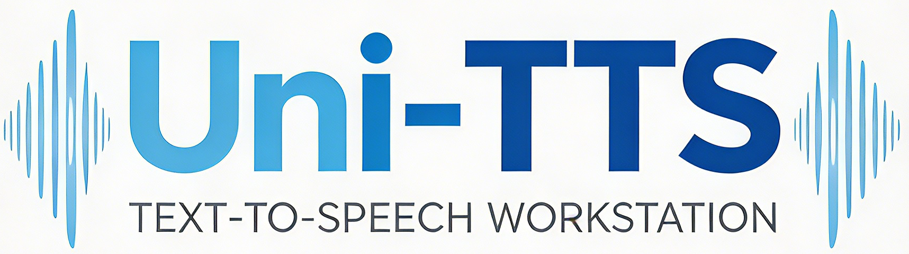

<div align="center">

  [English](README.en.md) | **简体中文**

  

  <p>
    <strong>一站式多引擎语音合成平台</strong>
  </p>

  <p>
    <a href="#功能特点">功能特点</a> •
    <a href="#支持的引擎">支持的引擎</a> •
    <a href="#快速开始">快速开始</a> •
    <a href="#使用说明">使用说明</a> •
    <a href="#许可证">许可证</a>
  </p>

</div>

---

## 功能特点

- 🚀 **一键安装**：每个引擎独立虚拟环境，一键自动安装，无依赖冲突
- 🎯 **统一界面**：所有引擎在同一个 Web 界面中管理，切换便捷
- 📦 **模型管理**：内置模型下载管理，支持 ModelScope / HuggingFace 源
- 🔧 **灵活配置**：支持 GPU / CPU 切换，Flash Attention 可选
- 🎨 **美观界面**：现代化 Vue 3 + Element Plus 前端，操作直观
- 🔊 **ASR 集成**：内置语音识别，自动填充参考音频文本
- ⚡ **并行加载**：多引擎可同时加载，互不干扰

## 支持的引擎

| 引擎 | 描述 | 最小显存 |
|------|------|----------|
| **GPT-SoVITS** | 1分钟语音数据即可训练高质量TTS模型 | 4 GB |
| **CosyVoice** | 阿里多语言大语音生成模型 | 4 GB |
| **Qwen3-TTS** | 通义千问3秒语音克隆，支持10种语言 | 6 GB |
| **IndexTTS-2** | B站情感丰富、时长可控的零样本TTS | 4 GB |
| **LuxTTS** | 轻量高速，1GB显存即可150倍实时 | 1 GB |
| **VoxCPM 2** | 清华无分词器TTS，30种语言48kHz | 8 GB |
| **MOSS-TTS** | 复旦开源语音全家桶，高保真长文本 | 4 GB |
| **Fish Audio S2 Pro** | 15000+情感标签，80+语言，100ms首帧 | 8 GB |

## 快速开始

### 环境要求

- Python 3.10+
- Node.js 18+
- （可选）NVIDIA GPU + CUDA 12.1+

### 安装与启动

```bash
# 克隆仓库
git clone https://github.com/monologue82/Uni-TTS.git
cd Uni-TTS

# 推荐使用虚拟环境
python -m venv .venv
.venv\Scripts\activate  # Windows
# source .venv/bin/activate  # Linux/Mac

# 安装后端依赖
pip install -r requirements.txt

# 启动（会自动安装前端依赖）
python start.py
```

启动后访问：
- 前端界面：http://localhost:5173
- 后端 API：http://localhost:8000

## 使用说明

### 1. 安装引擎

进入「引擎管理」页面，点击需要的引擎卡片上的「安装」按钮，等待自动安装完成。

### 2. 下载模型

进入「模型管理」页面，选择引擎后点击「下载」按钮下载对应模型。

### 3. 启动推理

回到主页，点击引擎卡片，选择「启动推理」或「Gradio 界面」，等待模型加载完成即可使用。

## 项目结构

```
Uni-TTS/
├── backend/          # 后端 (FastAPI)
│   ├── api/          # API 路由
│   ├── engines/      # 推理服务器
│   └── db/           # 数据库
├── frontend/         # 前端 (Vue 3 + Element Plus)
│   └── src/
├── engines/          # 各引擎源码（安装后生成）
├── venvs/            # 各引擎虚拟环境（安装后生成）
├── models/           # 模型文件（下载后生成）
└── start.py          # 启动脚本
```

## 许可证

本项目采用 **Creative Commons Attribution-NonCommercial-ShareAlike 4.0 International (CC BY-NC-SA 4.0)** 许可证。

**简要说明（非法律建议，仅供参考）：**

- ✅ **允许**：复制、分发、修改、改编本作品
- ✅ **要求**：必须署名、以相同协议发布、注明修改
- ❌ **禁止**：不得用于商业用途

完整许可证文本请参阅 [LICENSE](LICENSE) 文件。

各子引擎遵循其各自的开源协议，请在使用时遵守对应协议。

## 免责声明

本项目仅供学习研究使用，请勿用于任何非法用途。使用本项目生成的音频内容，使用者自行承担相关责任。

---

<div align="center">
  <p>如果觉得项目不错，欢迎给个 ⭐ Star</p>
</div>
